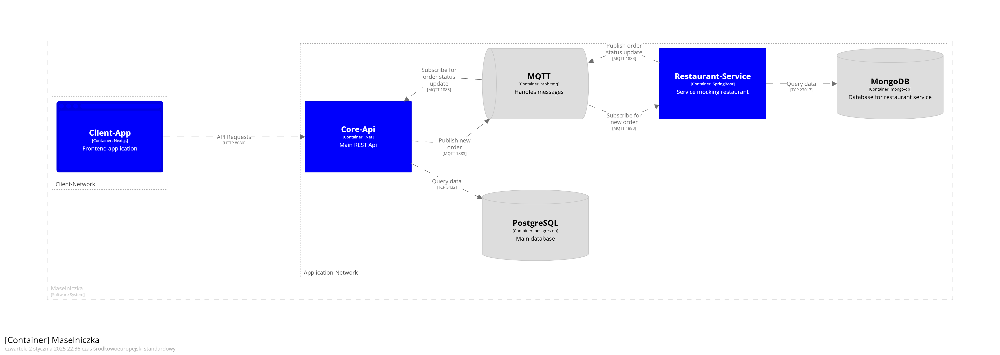

# GlovoMaslo

Glovo but only butter.



---

## Applications workflows
[](https://github.com/Dar3cz3Q-University/InternetEngineering/tree/master/src/client)

[](https://github.com/Dar3cz3Q-University/InternetEngineering/tree/master/src/core-api)

[](https://github.com/Dar3cz3Q-University/InternetEngineering/master/src/restaurant-service)

---

## Setup

### Requirements
* [Docker](https://www.docker.com/)

### Local development
1. Clone the repository:
   ```shell
   git clone https://github.com/Dar3cz3Q-University/InternetEngineering
   cd projekt-zaliczeniowy-maselniczka
   ```
2. Setup applications:
    * [Client-App](/src/client-app)
    * [Core-Api](/src/core-api)
    * [Restaurant-Service](/src/restaurant-service)
3. Start applications:
   ```shell
   docker compose up --watch
   ```

---

## Configuration

### Environment Variables

All default environment variables are in [.env.dist](src/.env.dist)
